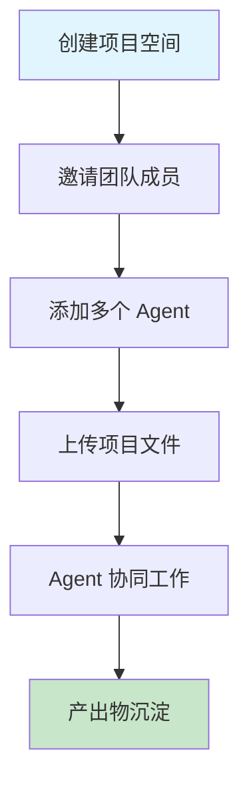
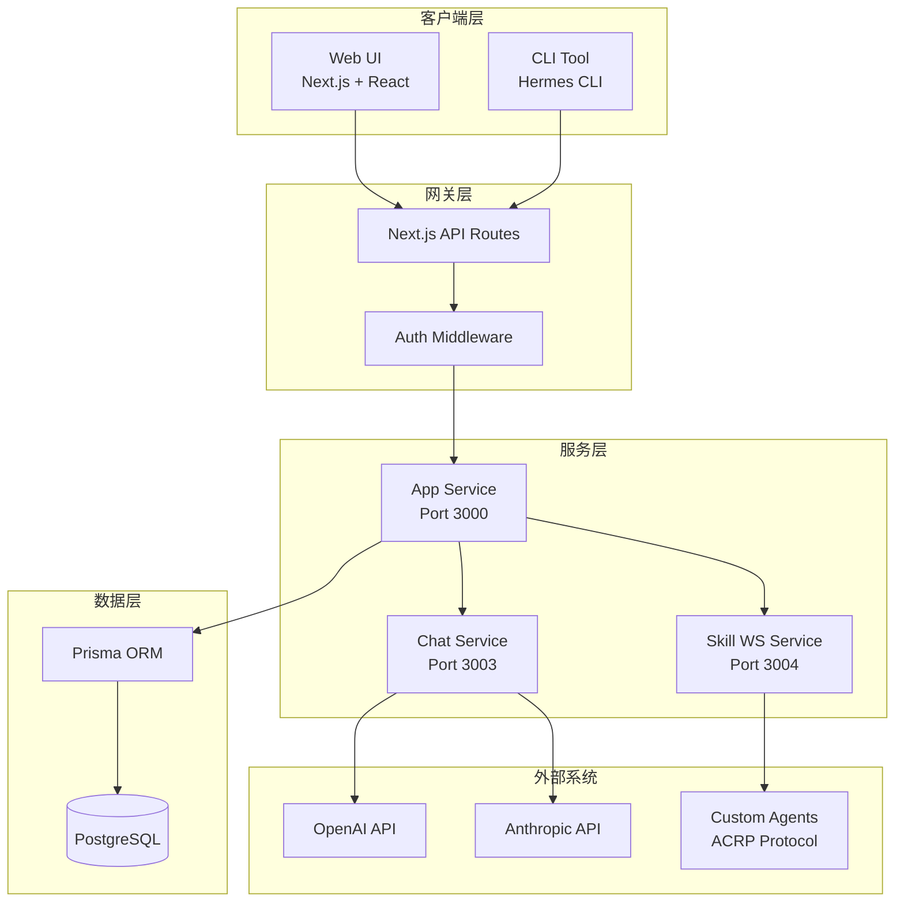
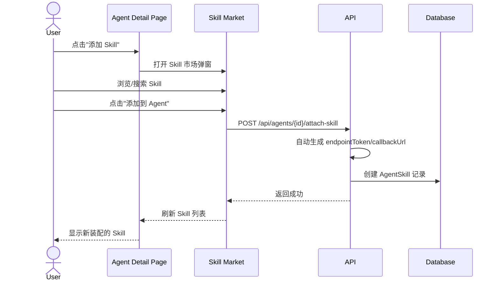
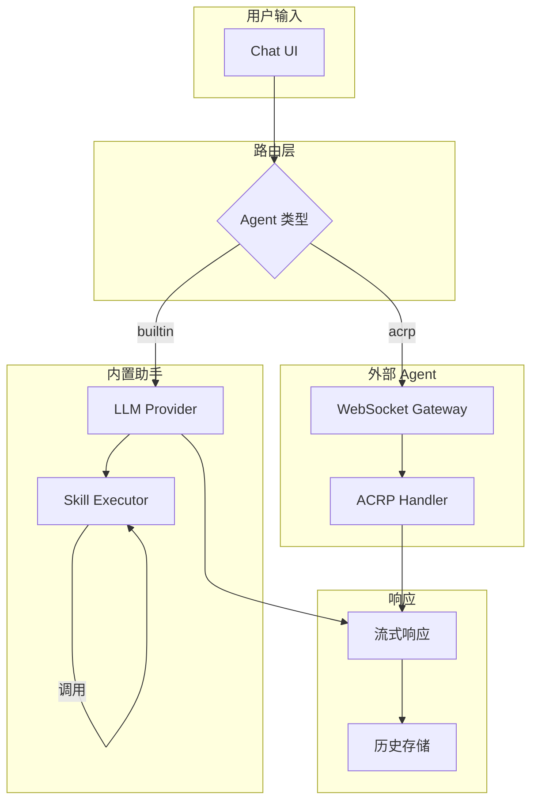
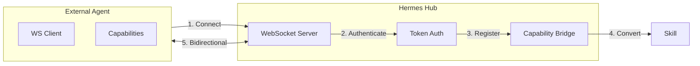
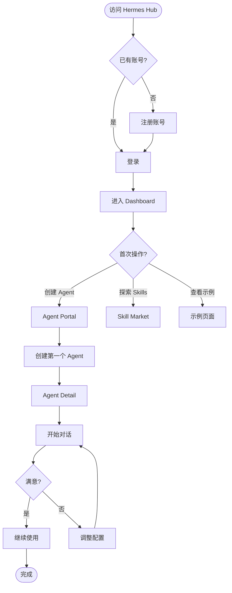
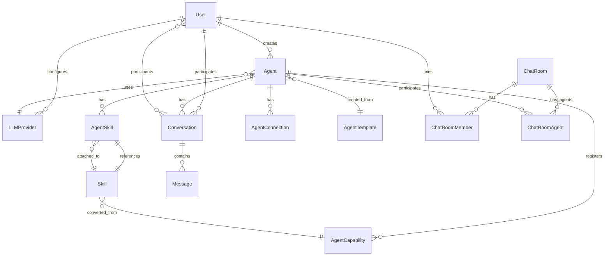
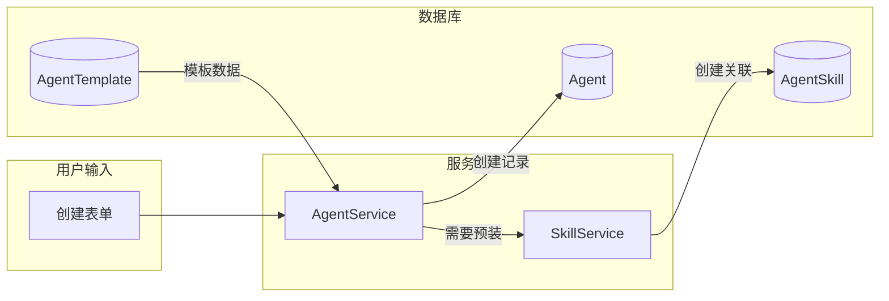

# Hermes Hub 产品设计文档

> **版本**: v2.0  
> **日期**: 2026-06-03  
> **状态**: 已完成重构  
> **文档类型**: 产品设计说明书 (PRD)

---

## 目录

1. [产品概述](#1-产品概述)
2. [用户画像与场景](#2-用户画像与场景)
3. [产品架构](#3-产品架构)
4. [核心功能设计](#4-核心功能设计)
5. [用户流程设计](#5-用户流程设计)
6. [数据模型设计](#6-数据模型设计)
7. [界面设计规范](#7-界面设计规范)
8. [技术实现要点](#8-技术实现要点)
9. [非功能需求](#9-非功能需求)
10. [附录](#10-附录)

---

## 1. 产品概述

### 1.1 产品定位

**Hermes Hub** 是一个多智能体协作平台，定位为 AI 智能体的"操作系统"——连接、管理和调度各类 AI 智能体（Agent）与技能（Skill），让开发者和个人用户能够快速构建、部署和使用 AI 助手。

### 1.2 核心价值主张

| 价值维度 | 描述 |
|---------|------|
| **统一入口** | 一个平台管理所有 Agent，无论是云端 LLM 还是本地 AI 工具 |
| **即插即用** | Skill 系统让 Agent 能力可扩展，像安装 App 一样简单 |
| **开放协议** | ACRP 协议支持任何 Agent 接入，打破平台壁垒 |
| **协作生态** | 多 Agent 协作，构建复杂 AI 工作流 |

### 1.3 目标用户

```
┌─────────────────────────────────────────────────────────────┐
│                    目标用户金字塔                            │
├─────────────────────────────────────────────────────────────┤
│                                                             │
│     ┌──────────┐                                            │
│     │ 开发者   │  <--- 使用 ACRP 接入自定义 Agent           │
│     │  ~20%   │      需要协议对接、技能开发                   │
│     └────┬─────┘                                            │
│          │                                                  │
│     ┌────┴─────┐                                            │
│     │ 进阶用户 │  <--- 使用模板创建专业 Agent                │
│     │  ~30%   │      需要工作流编排、多 Agent 协作           │
│     └────┬─────┘                                            │
│          │                                                  │
│     ┌────┴─────┐                                            │
│     │ 普通用户 │  <--- 使用内置助手快速上手                  │
│     │  ~50%   │      需要简单对话、一键创建                  │
│     └──────────┘                                            │
│                                                             │
└─────────────────────────────────────────────────────────────┘
```

### 1.4 竞品分析

| 维度 | Hermes Hub | 扣子 (Coze) | 飞书多维表格 | Dify | OpenClaw |
|------|------------|-------------|--------------|------|----------|
| **Agent 创建** | 3 种方式（内置/外部/模板） | 模板 + 自定义 | 一句话创建 | 工作流编排 | CLI 为主 |
| **Skill 生态** | 内置 + Git + ACRP 自动 | 插件市场 | 公式/自动化 | 工具节点 | 内置工具 |
| **外部 Agent** | ACRP 协议 | 不支持 | 不支持 | API 调用 | 本地优先 |
| **对话体验** | 页内对话 + 全局聊天 | 页内对话 | 表格内对话 | 调试界面 | 终端对话 |
| **多 Agent** | 聊天室模式 | 工作流 | 不支持 | 工作流 | 多实例 |
| **技术细节** | 可配置但默认隐藏 | 完全隐藏 | 完全隐藏 | 部分暴露 | 完全暴露 |
| **开源程度** | 开源 + 自托管 | 闭源 | 闭源 | 开源 | 开源 |

**差异化定位**: Hermes Hub 是唯一同时支持"开箱即用的内置助手"和"开放协议接入外部 Agent"的开源平台。

---

## 2. 用户画像与场景

### 2.1 用户画像

#### 画像 A: 小明的个人助手（普通用户）

```yaml
背景: 产品经理，需要 AI 辅助日常工作
技术能力: 能使用 ChatGPT，但不会编程
核心需求:
  - 快速创建不同场景的助手（写作、数据分析、编程辅助）
  - 不需要理解技术细节
  - 希望一次配置，长期使用
使用场景:
  - 使用"内容创作"模板创建写作助手
  - 直接对话生成文案
  - 查看历史记录回顾之前的创作
```

#### 画像 B: 李工的开发团队（进阶用户）

```yaml
背景: 10 人研发团队，需要统一 AI 工具
技术能力: 熟悉 AI 概念，能配置 API
核心需求:
  - 团队共享的 Agent 配置
  - 接入 Claude Code 等本地工具
  - 自定义 Skill 扩展能力
使用场景:
  - 创建"代码审查"Agent，接入 Claude Code
  - 开发内部 Skill（Git 提交规范检查）
  - 多 Agent 协作完成复杂任务
```

#### 画像 C: 王架构的企业集成（开发者）

```yaml
背景: 大型企业，需要集成内部系统
技术能力: 资深开发，理解协议设计
核心需求:
  - 自定义 Agent 接入内部系统
  - 完整的协议控制和监控
  - 安全性和审计能力
使用场景:
  - 基于 ACRP 协议开发企业 Agent
  - 实现自定义 Capability（操作内部 API）
  - 集成到企业 SSO 和审计系统
```

### 2.2 核心使用场景

#### 场景 1: 快速创建个人助手

```mermaid
flowchart LR
    A[用户进入 Agent Portal] --> B[选择"内置助手"]
    B --> C[填写名称+选择 LLM]
    C --> D[可选配置 System Prompt]
    D --> E[一键创建]
    E --> F[自动跳转到详情页]
    F --> G[直接开始对话]
    
    style A fill:#e1f5fe
    style G fill:#c8e6c9
```

#### 场景 2: 接入本地 AI 工具

```mermaid
flowchart LR
    A[用户选择"外部接入"] --> B[选择 Agent 类型]
    B --> C[系统自动生成 Token]
    C --> D[显示接入代码]
    D --> E[用户在本地运行代码]
    E --> F[Agent 自动连接]
    F --> G[Capability 自动转为 Skills]
    G --> H[开始对话]
    
    style A fill:#e1f5fe
    style H fill:#c8e6c9
```

#### 场景 3: 团队协作空间



---

## 3. 产品架构

### 3.1 系统架构图



### 3.2 功能模块划分

```
┌────────────────────────────────────────────────────────────────┐
│                        Hermes Hub                               │
├────────────────┬────────────────┬────────────────┬───────────────┤
│   Agent 管理    │   Skill 生态   │   对话系统     │   用户系统   │
├────────────────┼────────────────┼────────────────┼───────────────┤
│ • 创建 Agent   │ • Skill 市场   │ • 单 Agent 对话│ • 用户管理   │
│ • 配置 Agent   │ • Skill 装配   │ • 聊天室      │ • 权限控制   │
│ • 管理状态     │ • Skill 开发   │ • 消息历史    │ • OAuth 登录 │
│ • ACRP 接入    │ • Capability   │ • 上下文管理  │ • 使用统计   │
│ • 模板系统     │ • 自动转换     │ • 流式响应    │ • 设置管理   │
└────────────────┴────────────────┴────────────────┴───────────────┘
```

### 3.3 技术栈选型

| 层级 | 技术选型 | 选型理由 |
|------|---------|---------|
| **前端** | Next.js 16 + React 19 + TypeScript | SSR/SSG 支持、类型安全、生态丰富 |
| **UI 组件** | shadcn/ui + Tailwind CSS | 可定制、无障碍支持、现代设计 |
| **状态管理** | Zustand | 轻量、TypeScript 友好、无样板代码 |
| **后端** | Next.js API Routes + Node.js | 全栈统一、简化部署 |
| **数据库** | PostgreSQL + Prisma | 关系型数据、类型安全 ORM |
| **实时通信** | Socket.IO | WebSocket 封装、自动降级、房间支持 |
| **认证** | NextAuth.js | 多 Provider 支持、Session 管理 |
| **国际化** | next-intl | 与 Next.js 深度集成、支持复数/格式化 |
| **测试** | Vitest + Testing Library | 现代测试框架、组件测试友好 |

---

## 4. 核心功能设计

### 4.1 Agent 管理系统

#### 4.1.1 Agent 创建流程

**设计原则**: 从 7+ 步骤简化到 3 步以内

```
┌─────────────────────────────────────────────────────────────┐
│                     Agent Portal                             │
├─────────────────────────────────────────────────────────────┤
│                                                              │
│  ┌──────────────────────────────────────────────────────┐   │
│  │                  快速创建引导                         │   │
│  ├──────────────────────────────────────────────────────┤   │
│  │                                                      │   │
│  │  ┌──────────────┐  ┌──────────────┐  ┌──────────┐ │   │
│  │  │  🤖          │  │  🔗          │  │  📋      │ │   │
│  │  │  内置助手     │  │  外部接入     │  │  模板    │ │   │
│  │  │              │  │              │  │          │ │   │
│  │  │ • 选择 LLM   │  │ • 选择类型   │  │ • 6种预设│ │   │
│  │  │ • 填 Prompt  │  │ • 一键生成   │  │ • 预装技能│ │   │
│  │  │ • 3 步完成   │  │ • 自动 Token │  │ • 开箱即用│ │   │
│  │  └──────────────┘  └──────────────┘  └──────────┘ │   │
│  │                                                      │   │
│  └──────────────────────────────────────────────────────┘   │
│                                                              │
│  ┌──────────────────────────────────────────────────────┐   │
│  │                  我的 Agents                         │   │
│  ├──────────────────────────────────────────────────────┤   │
│  │ 🤖 研发助手    | 内置 | GPT-4    | 🟢在线 | ...     │   │
│  │ 🔗 Hermes Dev | 外部 | ws       | 🟢在线 | ...      │   │
│  │ 🤖 内容助手    | 模板 | Claude  | 🔴离线 | ...      │   │
│  └──────────────────────────────────────────────────────┘   │
│                                                              │
└─────────────────────────────────────────────────────────────┘
```

**三种创建方式对比**:

| 方式 | 输入步骤 | 技术配置 | 适用场景 | 目标用户 |
|------|---------|---------|---------|---------|
| **内置助手** | 3 步（名称、LLM、Prompt） | 无 | 快速原型、个人助手 | 普通用户 |
| **外部接入** | 2 步（名称、类型） | 系统自动生成 | 接入 Claude Code/Trae | 进阶用户 |
| **职业模板** | 2 步（选择模板、确认） | 预配置 | 专业场景、团队协作 | 普通用户 |

#### 4.1.2 Agent Detail 页面设计

**设计原则**: 5 Tab 简化为 3 Tab，所有操作在同一页面完成

```
┌────────────────────────────────────────────────────────────────┐
│ ← 返回    研发助手    🟢在线    [编辑] [删除]                   │
├────────────────────────────────────────────────────────────────┤
│ [配置]    [对话]    [历史]                                      │
├────────────────────────────────────────────────────────────────┤
│                                                                │
│  ─────────────── 配置 Tab ───────────────                      │
│                                                                │
│  基本信息                                                      │
│  ├─ 名称: 研发助手                                            │
│  ├─ 描述: 辅助研发团队进行技术调研和代码审查                   │
│  ├─ System Prompt: [编辑区域]                                   │
│  └─ LLM: OpenAI / GPT-4o                                      │
│                                                                │
│  已装配技能                                                    │
│  ├─ 🔍 web-search        [开] [关] [卸载]                     │
│  ├─ 📄 pdf-reader        [开] [关] [卸载]                     │
│  ├─ 💻 code-execution    [开] [关] [卸载]                     │
│  └─ [+ 从 Skill 市场添加]                                     │
│                                                                │
│  ▼ 接入信息（仅外部 Agent 显示）                                │
│  ├─ Agent Token: acrp_xxxxx [复制]                             │
│  ├─ 接入代码: [Python] [JavaScript] [CLI]                    │
│  └─ Capability: [查看列表] [测试调用]                          │
│                                                                │
├────────────────────────────────────────────────────────────────┤
│                                                                │
│  ─────────────── 对话 Tab ───────────────                      │
│                                                                │
│  ┌─────────────────────────────────────────────────────────┐   │
│  │                                                         │   │
│  │  Agent: 你好，我是研发助手。有什么可以帮你的？          │   │
│  │                                                         │   │
│  │  User: 帮我搜索 React 19 的新特性                      │   │
│  │                                                         │   │
│  │  Agent: 🔍 [调用 web-search]...                         │   │
│  │         React 19 的新特性包括...                        │   │
│  │                                                         │   │
│  └─────────────────────────────────────────────────────────┘   │
│                                                                │
│  [输入消息...] [发送]                                          │
│                                                                │
├────────────────────────────────────────────────────────────────┤
│                                                                │
│  ─────────────── 历史 Tab ───────────────                      │
│                                                                │
│  最近对话                                                       │
│  ├─ 2024-06-01  React 19 调研                                 │
│  ├─ 2024-05-28  代码审查辅助                                  │
│                                                                │
│  Skill 调用记录                                                │
│  ├─ web-search  10次  成功率 100%                            │
│  ├─ pdf-reader  3次   成功率 100%                             │
│                                                                │
└────────────────────────────────────────────────────────────────┘
```

### 4.2 Skill 生态系统

#### 4.2.1 Skill 概念统一

**术语映射** (系统内部保留，用户侧统一):

| 系统概念 | 用户可见 | 内部存储 | 说明 |
|---------|---------|---------|------|
| Skill | 技能 | `Skill` | 内置或可调用能力 |
| Plugin | 技能 | `Skill` (handlerType=protocol) | 通过协议连接的外部能力 |
| Connection | (自动) | `AgentConnection` | WebSocket/HTTP 连接 |
| Capability | 自动技能 | `Skill` (handlerType=acrp) | ACRP 自动转换的能力 |

**用户心智模型**:
```
Agent = 数字助手
Skill = Agent 会做的事情（搜索、读文档、执行代码...）

操作: "给我的 Agent 装上 Skills"
```

#### 4.2.2 Skill 装配流程



#### 4.2.3 Skill 类型系统

```typescript
// Skill 处理器类型
enum HandlerType {
  BUILTIN = 'builtin',      // 内置实现，直接执行
  WEBHOOK = 'webhook',      // HTTP 回调
  FUNCTION = 'function',    // 函数调用
  ACRP = 'acrp',            // ACRP Agent 能力自动转换
  PROTOCOL = 'protocol',    // Skill Protocol 连接
}

// Skill 分类
enum SkillCategory {
  COMMUNICATION = 'communication',  // 通讯类（邮件、消息）
  PRODUCTIVITY = 'productivity',    // 生产力（日程、提醒）
  DEVELOPMENT = 'development',       // 开发（代码、Git）
  DATA = 'data',                     // 数据（分析、可视化）
  MEDIA = 'media',                   // 媒体（图片、视频、音频）
  UTILITY = 'utility',               // 工具（搜索、计算）
  GENERAL = 'general',               // 通用
}
```

### 4.3 对话系统

#### 4.3.1 对话架构



#### 4.3.2 对话特性

| 特性 | 说明 |
|------|------|
| **流式响应** | SSE 实时输出，支持打字效果 |
| **Skill 调用可视化** | 显示 Skill 调用过程和结果 |
| **上下文管理** | Token 超限自动压缩 |
| **多会话** | 支持同时与多个 Agent 对话 |
| **聊天室** | 多 Agent 群聊模式 |

### 4.4 ACRP 协议系统

#### 4.4.1 协议架构



#### 4.4.2 连接流程

```
┌─────────────────────────────────────────────────────────────┐
│                   外部 Agent 接入流程                        │
├─────────────────────────────────────────────────────────────┤
│                                                              │
│  Step 1: Hub 生成 Token                                       │
│  ├─ User: 创建外部 Agent                                     │
│  └─ System: 生成 acrp_xxxxx Token                           │
│                                                              │
│  Step 2: 复制接入代码                                        │
│  ├─ System: 生成 Python/JS/CLI 代码                         │
│  └─ User: 复制代码到本地环境                                  │
│                                                              │
│  Step 3: Agent 连接                                          │
│  ├─ Agent: 使用 Token 连接 ws://localhost:3004               │
│  ├─ Hub: 验证 Token，建立连接                                 │
│  └─ UI: 显示"已连接"状态                                     │
│                                                              │
│  Step 4: Capability 注册                                     │
│  ├─ Agent: 发送 capabilities 列表                            │
│  ├─ Hub: 自动转换为 Skills                                   │
│  └─ Hub: 自动装配到 Agent                                     │
│                                                              │
│  Step 5: 开始使用                                            │
│  ├─ User: 在对话 Tab 发送消息                                │
│  ├─ Hub: 通过 WebSocket 转发                                  │
│  └─ Agent: 处理并返回结果                                     │
│                                                              │
└─────────────────────────────────────────────────────────────┘
```

#### 4.4.3 Capability 自动转换

```typescript
// Capability (来自外部 Agent) -> Skill (Hub 内部)
interface Capability {
  capabilityId: string;    // "model.switch"
  name: string;            // "切换模型"
  description: string;     // "切换到不同的 LLM 模型"
  category: string;        // "system"
  parameters: JSONSchema;   // 参数定义
}

// 自动转换为
interface Skill {
  id: string;              // 新生成
  name: string;            // "model-switch" (normalized)
  displayName: string;     // "切换模型"
  description: string;     // 同上
  category: string;        // 同上
  handlerType: 'acrp';     // 标记来源
  sourceCapabilityId: string; // "model.switch"
  sourceAgentId: string;   // Agent ID
}
```

### 4.5 模板系统

#### 4.5.1 预置模板列表

| 模板 | 类别 | 预装 Skills | System Prompt 风格 |
|------|------|-------------|-------------------|
| **研发助手** | Development | web-search, code-execution, pdf | 技术专家，代码优先 |
| **运营助手** | Productivity | web-search, charts, ppt, xlsx | 数据驱动，结果导向 |
| **内容创作** | Media | web-search, blog-writer, seo | 创意写作，SEO 优化 |
| **金融分析** | Data | web-search, stock-analysis, finance | 量化分析，风险提示 |
| **项目管理** | Productivity | web-search, auto-target-tracker | 任务拆解，进度追踪 |
| **通用助手** | General | web-search | 友好、通用 |

#### 4.5.2 模板数据结构

```typescript
interface AgentTemplate {
  id: string;
  name: string;              // "research-assistant"
  displayName: string;       // "研发助手"
  description: string;       // "辅助代码开发..."
  category: 'assistant' | 'worker' | 'coordinator';
  icon?: string;             // Lucide icon name
  systemPrompt: string;      // 预设 Prompt
  skillIds: string[];        // 预装 Skill IDs
  config: {
    model?: string;
    temperature?: number;
    maxTokens?: number;
  };
}
```

---

## 5. 用户流程设计

### 5.1 新用户首次使用流程



### 5.2 Agent 创建完整流程

#### 流程 A: 内置助手

```
用户路径:
1. Agent Portal → 点击"内置助手"卡片
2. 填写表单:
   - 名称（必填）
   - 描述（可选）
   - 选择 LLM Provider（默认 OpenAI）
   - 选择 Model（默认 GPT-4）
   - System Prompt（可选，有预设模板）
   - 温度设置（可选，默认 0.7）
3. 点击"创建"
4. 系统自动:
   - 创建 Agent 记录
   - 关联 LLM Provider
   - 跳转到 Agent Detail
5. 用户在 Detail 页面直接对话

总步骤: 3 步（Portal → 表单 → Detail）
```

#### 流程 B: 外部接入

```
用户路径:
1. Agent Portal → 点击"外部接入"卡片
2. 选择 Agent 类型:
   - Hermes Agent
   - Claude Code
   - Trae
   - OpenClaw
   - 自定义
3. 填写名称和描述
4. 点击"创建"
5. 系统自动:
   - 创建 Agent 记录
   - 生成 agentToken (acrp_xxxxx)
   - 生成接入代码（Python/JS/CLI）
6. 显示接入引导页面:
   - 显示 Token [复制按钮]
   - 显示代码片段 [切换语言]
   - 实时连接状态指示器
7. 用户在本地运行代码
8. Hub 检测到连接，状态变为"已连接"
9. Capability 自动转为 Skills
10. 用户开始对话

总步骤: 4 步（Portal → 类型选择 → 接入引导 → 对话）
```

#### 流程 C: 从模板创建

```
用户路径:
1. Agent Portal → 点击"职业模板"卡片
2. 浏览模板列表（卡片展示）
3. 点击模板卡片查看详情:
   - 显示描述
   - 显示预装 Skills 列表
   - 显示预设配置
4. 点击"使用此模板"
5. 填写名称（可修改）
6. 点击"创建"
7. 系统自动:
   - 创建 Agent
   - 复制模板配置
   - 预装所有 Skills
8. 跳转到 Agent Detail
9. 用户直接对话或进一步配置

总步骤: 3 步（Portal → 模板选择 → Detail）
```

### 5.3 Skill 装配流程

```
用户路径:
1. 在 Agent Detail → 配置 Tab
2. 查看"已装配 Skills"区域
3. 点击"+ 从 Skill 市场添加"
4. 打开 Skill Market 弹窗:
   - 分类筛选（全部/开发/数据/媒体...）
   - 搜索框
   - Skill 卡片列表（图标、名称、描述）
5. 浏览并找到需要的 Skill
6. 点击 Skill 卡片的"添加"按钮
7. 系统自动:
   - 生成 endpointToken（如需要）
   - 创建 AgentSkill 记录
   - 设置默认配置
8. 弹窗关闭，Skill 列表刷新
9. 新 Skill 默认启用，可立即使用

可选操作:
- 点击 Skill 的开关：启用/禁用
- 点击 Skill 的设置：修改配置
- 点击 Skill 的卸载：移除
```

---

## 6. 数据模型设计

### 6.1 核心实体关系图



### 6.2 核心模型定义

#### User 模型

```prisma
model User {
  id        String   @id @default(cuid())
  email     String   @unique
  name      String
  avatar    String?
  password  String
  bio       String?
  role      String   @default("user") // user, admin
  status    String   @default("online")
  createdAt DateTime @default(now())
  updatedAt DateTime @updatedAt

  agents         Agent[]
  providers      LLMProvider[]
  conversations  ConversationParticipant[]
  messages       Message[]
  memberships    ChatRoomMember[]
}
```

#### Agent 模型

```prisma
model Agent {
  id          String   @id @default(cuid())
  userId      String
  name        String
  description String?
  avatar      String?
  systemPrompt String?
  
  // 模式
  mode        String   @default("builtin") // builtin, acrp
  agentCategory String @default("assistant") // assistant, worker, coordinator
  
  // LLM 配置
  providerId  String?
  model       String?
  temperature Float?
  maxTokens   Int?
  
  // ACRP 配置
  agentToken      String?   @unique
  agentType       String?   // hermes-agent, claude-code, trae, custom
  agentVersion    String?
  agentPlatform   String?
  agentMetadata   String    @default("{}")
  wsConnected     Boolean   @default(false)
  lastHeartbeatAt DateTime?
  registeredAt    DateTime?
  
  // 模板
  templateId      String?
  
  status      String   @default("offline") // online, offline, busy, error
  isPublic    Boolean  @default(false)
  createdAt   DateTime @default(now())
  updatedAt   DateTime @updatedAt

  user         User              @relation(fields: [userId], references: [id], onDelete: Cascade)
  provider     LLMProvider?      @relation(fields: [providerId], references: [id])
  template     AgentTemplate?    @relation(fields: [templateId], references: [id])
  skills       AgentSkill[]
  capabilities AgentCapability[]
  conversations Conversation[]
}
```

#### Skill 模型

```prisma
model Skill {
  id            String   @id @default(cuid())
  name          String   @unique
  displayName   String
  description   String
  category      String   @default("general")
  icon          String?
  
  // 处理器配置
  handlerType   String   @default("builtin") // builtin, webhook, function, acrp, protocol
  handlerUrl    String?
  
  // Skill Protocol
  endpointToken    String?  @unique
  callbackUrl      String?
  callbackSecret   String?
  protocolVersion  String   @default("v1")
  events           String   @default("[]")
  wsConnected      Boolean  @default(false)
  
  // 配置
  configSchema     String   @default("{}")
  parameters       String   @default("[]")
  instructions     String   @default("")
  
  // 来源追踪
  sourceType       String   @default("built-in") // built-in, agentskills-registry, git, acrp-auto
  sourceCapabilityId String?
  sourceAgentId      String?
  
  isEnabled     Boolean  @default(true)
  createdAt     DateTime @default(now())
  updatedAt     DateTime @updatedAt

  agents AgentSkill[]
}
```

#### AgentSkill 关联模型

```prisma
model AgentSkill {
  id        String  @id @default(cuid())
  agentId   String
  skillId   String
  config    String  @default("{}")
  isEnabled Boolean @default(true)
  priority  Int     @default(0)

  // Skill Protocol 绑定配置
  endpointToken   String?   @unique
  callbackUrl     String?
  callbackSecret  String?
  lastInvokedAt   DateTime?
  invokeCount     Int       @default(0)
  wsConnected     Boolean   @default(false)

  agent Agent @relation(fields: [agentId], references: [id], onDelete: Cascade)
  skill Skill @relation(fields: [skillId], references: [id])

  @@unique([agentId, skillId])
}
```

#### AgentTemplate 模型

```prisma
model AgentTemplate {
  id          String   @id @default(cuid())
  name        String   @unique
  displayName String
  description String
  category    String   @default("assistant")
  icon        String?
  systemPrompt String
  skillIds    String   @default("[]")
  config      String   @default("{}")
  isPublic    Boolean  @default(true)
  createdAt   DateTime @default(now())
  updatedAt   DateTime @updatedAt
  
  agents Agent[]
}
```

### 6.3 数据流设计

#### Agent 创建数据流



---

## 7. 界面设计规范

### 7.1 设计系统

基于 **shadcn/ui** 和 **Tailwind CSS** 构建的设计系统：

#### 颜色系统

```css
/* Primary */
--primary: hsl(222 47% 11%);      /* 深灰蓝 - 主色 */
--primary-foreground: hsl(210 40% 98%);

/* Secondary */
--secondary: hsl(210 40% 96.1%); /* 浅灰 - 辅助 */
--secondary-foreground: hsl(222 47% 11%);

/* Accent */
--accent: hsl(210 40% 96.1%);     /* 强调 */
--accent-foreground: hsl(222 47% 11%);

/* Status */
--success: hsl(142 76% 36%);      /* 绿色 - 在线/成功 */
--warning: hsl(38 92% 50%);       /* 橙色 - 警告 */
--destructive: hsl(0 84% 60%);    /* 红色 - 离线/错误 */

/* Muted */
--muted: hsl(210 40% 96.1%);      /* 背景灰 */
--muted-foreground: hsl(215 16% 47%); /* 次要文字 */
```

#### 字体系统

| 级别 | 大小 | 字重 | 用途 |
|------|------|------|------|
| H1 | 2rem (32px) | 700 | 页面标题 |
| H2 | 1.5rem (24px) | 600 | 区块标题 |
| H3 | 1.25rem (20px) | 600 | 卡片标题 |
| Body | 1rem (16px) | 400 | 正文 |
| Small | 0.875rem (14px) | 400 | 辅助文字 |
| XSmall | 0.75rem (12px) | 400 | 标签 |

#### 间距系统

```css
/* 基于 4px 的倍数 */
--space-1: 0.25rem;  /* 4px */
--space-2: 0.5rem;   /* 8px */
--space-3: 0.75rem;  /* 12px */
--space-4: 1rem;     /* 16px */
--space-6: 1.5rem;   /* 24px */
--space-8: 2rem;     /* 32px */
--space-12: 3rem;    /* 48px */
```

### 7.2 组件规范

#### Agent 卡片

```
┌─────────────────────────────────────────┐
│  ┌─────┐                                │
│  │ 🤖  │  Agent 名称                     │
│  └─────┘  类型标签 | 状态指示            │
│           描述文字...                     │
│  ┌────────┐ ┌────────┐ ┌────────┐       │
│  │ Skill1 │ │ Skill2 │ │ +3    │       │
│  └────────┘ └────────┘ └────────┘       │
└─────────────────────────────────────────┘

规格:
- 宽度: 280px - 320px
- 高度: auto (最小 120px)
- 圆角: 12px (--radius-lg)
- 阴影: sm (默认), md (hover)
- 边框: 1px solid border
- 状态指示: 8px 圆点 (绿色=在线, 灰色=离线)
```

#### Skill 标签

```
┌───────────────────────┐
│  🔍  web-search  [×]  │
└───────────────────────┘

规格:
- 高度: 28px
- 圆角: 6px (--radius-md)
- 背景: secondary
- 图标: 16px Lucide icon
- 删除按钮: 悬停显示
```

#### 对话气泡

```
User:
┌─────────────────────────────┐
│ 用户消息内容                  │
│                    12:34   │
└─────────────────────────────┘

Agent:
┌─────────────────────────────┐
│  🤖 Agent 名称               │
│ Agent 消息内容               │
│ [Skill: web-search]          │
│                    12:35   │
└─────────────────────────────┘

规格:
- 最大宽度: 80%
- 内边距: 12px 16px
- 圆角: 16px
- User: 右侧对齐, primary 背景
- Agent: 左侧对齐, secondary 背景
```

### 7.3 布局规范

#### Agent Portal 布局

```
┌─────────────────────────────────────────────────────────────┐
│  Sidebar    │              Main Content                      │
│  (240px)    │                                              │
│             │  ┌─────────────────────────────────────────┐ │
│  Dashboard  │  │           Quick Create Cards            │ │
│  Agents     │  │  [Builtin] [External] [Templates]         │ │
│  Skills     │  └─────────────────────────────────────────┘ │
│  Chat       │                                              │
│  ...        │  ┌─────────────────────────────────────────┐ │
│             │  │           My Agents Grid                │ │
│             │  │  [Card] [Card] [Card] [Card]            │ │
│             │  │  [Card] [Card] ...                      │ │
│             │  └─────────────────────────────────────────┘ │
│             │                                              │
└─────────────────────────────────────────────────────────────┘
```

#### Agent Detail 布局

```
┌─────────────────────────────────────────────────────────────┐
│  Sidebar    │              Main Content                      │
│             │                                              │
│             │  ┌─────────────────────────────────────────┐ │
│             │  │  Header: 名称 | 状态 | 操作按钮        │ │
│             │  ├─────────────────────────────────────────┤ │
│             │  │  [配置] [对话] [历史]                    │ │
│             │  ├─────────────────────────────────────────┤ │
│             │  │                                          │ │
│             │  │  Tab Content                             │ │
│             │  │  (配置/对话/历史)                        │ │
│             │  │                                          │ │
│             │  └─────────────────────────────────────────┘ │
│             │                                              │
└─────────────────────────────────────────────────────────────┘
```

### 7.4 响应式设计

| 断点 | 宽度 | 布局调整 |
|------|------|---------|
| **Desktop** | ≥1280px | 完整侧边栏 + 主内容区 |
| **Laptop** | 1024-1279px | 可收起侧边栏 |
| **Tablet** | 768-1023px | 侧边栏变底部导航 |
| **Mobile** | <768px | 单栏布局，抽屉导航 |

---

## 8. 技术实现要点

### 8.1 状态管理

使用 **Zustand** 进行全局状态管理：

```typescript
// store.ts
interface AppState {
  // View 状态
  viewMode: ViewMode;
  setViewMode: (mode: ViewMode) => void;
  
  // Agent 状态
  selectedAgentId: string | null;
  setSelectedAgentId: (id: string | null) => void;
  
  // Skill 状态
  selectedSkillId: string | null;
  setSelectedSkillId: (id: string | null) => void;
  
  // UI 状态
  sidebarCollapsed: boolean;
  toggleSidebar: () => void;
  isCommandPaletteOpen: boolean;
  setCommandPaletteOpen: (open: boolean) => void;
}
```

### 8.2 API 设计

#### RESTful API 规范

| 资源 | 操作 | Endpoint | 说明 |
|------|------|----------|------|
| Agent | 创建内置 | POST /api/agents/create-builtin | 简化参数 |
| Agent | 创建外部 | POST /api/agents/create-external | 自动生成 token |
| Agent | 从模板 | POST /api/agents/create-from-template | 自动装配 |
| Agent | 获取详情 | GET /api/agents/{id}/unified-detail | 统一详情 |
| Agent | 装配 Skill | POST /api/agents/{id}/attach-skill | 一键装配 |
| Agent | 对话 | POST /api/agents/{id}/chat | 页内对话 |

#### 错误处理规范

```typescript
interface ApiError {
  error: string;
  details?: string;
  code: string;
}

// HTTP 状态码映射
400 - 参数错误
401 - 未认证
403 - 无权限
404 - 资源不存在
409 - 资源冲突
500 - 服务器错误
```

### 8.3 实时通信

#### WebSocket 连接管理

```typescript
// Socket.IO 事件定义
interface ServerToClientEvents {
  'agent:status': (data: { agentId: string; status: string }) => void;
  'skill:invoked': (data: { agentId: string; skillName: string }) => void;
  'message:new': (data: { conversationId: string; message: Message }) => void;
}

interface ClientToServerEvents {
  'agent:subscribe': (agentId: string) => void;
  'agent:unsubscribe': (agentId: string) => void;
  'message:send': (data: { conversationId: string; content: string }) => void;
}
```

### 8.4 性能优化

| 优化点 | 策略 |
|--------|------|
| **首屏加载** | SSR + 代码分割 + 懒加载 |
| **Agent 列表** | 虚拟滚动 (react-window) |
| **对话历史** | 分页加载 + 无限滚动 |
| **Skill 调用** | 防抖 + 缓存 |
| **图片资源** | Next.js Image 组件优化 |
| **WebSocket** | 自动重连 + 心跳检测 |

---

## 9. 非功能需求

### 9.1 性能指标

| 指标 | 目标值 | 测量方式 |
|------|--------|---------|
| 首屏加载时间 | < 2s | Lighthouse |
| Agent 详情页加载 | < 1.5s | API 响应时间 |
| Skill 装配响应 | < 500ms | API 响应时间 |
| 对话首条消息 | < 3s | 端到端测量 |
| WebSocket 连接 | < 1s | 连接时间 |
| 并发用户支持 | 1000+ | 压力测试 |

### 9.2 安全要求

| 方面 | 措施 |
|------|------|
| **认证** | JWT + Session 双模式，支持 OAuth |
| **授权** | RBAC 权限模型，资源级访问控制 |
| **传输** | HTTPS/WSS 强制加密 |
| **存储** | 敏感字段加密（API Key、Token） |
| **注入** | SQL 注入防护（Prisma ORM） |
| **XSS** | React 自动转义 + CSP 策略 |
| **CSRF** | SameSite Cookie + CSRF Token |

### 9.3 可访问性

| 标准 | 要求 |
|------|------|
| **WCAG** | 2.1 AA 级合规 |
| **键盘** | 全功能支持 Tab 导航 |
| **屏幕阅读器** | ARIA 标签完整 |
| **对比度** | 文本对比度 ≥ 4.5:1 |
| **焦点** | 可见焦点指示器 |

### 9.4 浏览器兼容性

| 浏览器 | 最低版本 |
|--------|---------|
| Chrome | 90+ |
| Firefox | 88+ |
| Safari | 14+ |
| Edge | 90+ |

---

## 10. 附录

### 10.1 术语表

| 术语 | 定义 |
|------|------|
| **Agent** | 智能体，可执行任务的 AI 实体 |
| **Skill** | 技能，Agent 的能力模块 |
| **ACRP** | Agent Capability Registration Protocol，智能体能力注册协议 |
| **Capability** | 能力，ACRP Agent 注册的可用功能 |
| **Builtin** | 内置模式，使用云端 LLM 的 Agent |
| **Portal** | 统一入口，Agent 管理的主界面 |
| **Handler** | 处理器，Skill 的执行方式 |
| **Bridge** | 桥接器，ACRP 到 Skill 的自动转换 |

### 10.2 文件清单

| 文件 | 路径 | 说明 |
|------|------|------|
| AgentPortal | `src/components/views/AgentPortal.tsx` | Agent 统一入口 |
| AgentDetail | `src/components/views/AgentDetail.tsx` | Agent 详情页 |
| AgentService | `src/lib/agent-service.ts` | Agent 服务层 |
| SkillService | `src/lib/skill-service.ts` | Skill 服务层 |
| CapabilityBridge | `src/lib/capability-bridge.ts` | 能力自动转换 |
| api-client | `src/lib/api-client.ts` | API 客户端 |

### 10.3 变更日志

| 版本 | 日期 | 变更 |
|------|------|------|
| v2.0 | 2026-06-03 | Agent Portal 简化重构 |
| v1.0 | 2026-04-XX | 初始版本发布 |

---

**文档结束**

*本文档由 Hermes Hub 产品团队维护*  
*最后更新: 2026-06-03*
